# Enhanced Document Generation with PromptFlow Integration

A comprehensive guide demonstrating how to enhance Microsoft's Document Generation Solution Accelerator with PromptFlow for intelligent data querying and document template generation. This project transforms a basic AI Search implementation into a sophisticated dual-LLM system capable of precise SQL queries, semantic search, and intelligent document generation.

## 📚 Table of Contents

- [Original Solution Overview](#original-solution-overview)
- [Original Solution Architecture](#original-solution-architecture)
- [Business Scenario](#business-scenario)
- [Enhanced Business Scenario: Fitness Data Analytics](#enhanced-business-scenario-fitness-data-analytics)
- [Why PromptFlow + AI Search](#why-promptflow--ai-search)
- [Enhanced Solution Architecture](#enhanced-solution-architecture)
- [PromptFlow Deep Dive](#promptflow-deep-dive)
- [Quick Start Guide](#quick-start-guide)
- [Local PromptFlow Development](#local-promptflow-development)
- [User Interface Documentation](#user-interface-documentation)
- [Changes from Base Microsoft App](#changes-from-base-microsoft-app)
- [Testing & Validation](#testing--validation)
- [Environment Configuration](#environment-configuration)
- [Deployment Options](#deployment-options)
- [Migration Guide](#migration-guide)
- [Troubleshooting](#troubleshooting)
- [Development Best Practices](#development-best-practices)
- [Performance Considerations](#performance-considerations)

## Original Solution Overview

Microsoft's Document Generation Solution Accelerator leverages Azure OpenAI Service and Azure AI Search to identify relevant documents, summarize unstructured information, and generate document templates. It uses sample data from "generic AI-generated promissory notes" and is intended for demonstration purposes.

## Original Solution Architecture

The original Microsoft solution includes an architecture diagram showing the system's components and integration points between Azure services, focusing on document retrieval and template generation using AI Search.

## Business Scenario

**Original Microsoft Scope:**
"Put your data to work by reducing blank page anxiety, speeding up document drafting, improving draft document quality, and reference information quickly - keeping experts in their expertise."

The original solution aims to help organizations draft document templates like:
- Invoices
- End-user Contracts  
- Purchase Orders
- Investment Proposals
- Grant Submissions

**Key Business Values:**
- Quickly draft templates
- Easy sharing with co-authors
- Contextualizing information
- Increasing response confidence
- Enhancing data security

## Enhanced Business Scenario: Fitness Data Analytics

**Our Enhancement Scope:**
(example for go-by) Transform fitness tracking data into actionable insights and professional documents. Our enhanced system demonstrates how to integrate structured CosmosDB data with AI Search capabilities to create intelligent fitness document generation.

**Enhanced Capabilities:**
- **Intelligent Workout Analysis**: Convert raw fitness data into personalized insights
- **Progress Documentation**: Generate professional progress reports, training plans, and goal tracking documents
- **Natural Language Queries**: Ask questions like "How has my bench press progressed?" and receive detailed analysis
- **Dual-LLM Architecture**: Combine SQL precision with semantic understanding for comprehensive analysis

**Example Use Cases:**
- Monthly fitness progress reports for personal trainers
- Goal tracking documents for fitness challenges
- Workout plan templates based on historical performance
- Achievement summaries for motivation and sharing

The goal of this example is to determine how best to query a CosmosDB and use those query results as part of chat and document generation output.

## 🤔 Fundamental Question: Do You Even Need PromptFlow?

**Critical First Decision**: *Could you achieve the same results with LangChain, a custom Python script, or other alternatives?*

### Understanding What PromptFlow Actually Provides

Before diving into PromptFlow + AI Search, consider whether the PromptFlow orchestration layer adds value to your specific use case:

**PromptFlow's Core Value Propositions:**
- **Visual Workflow Design**: DAG-based flow representation with drag-and-drop editing
- **Enterprise Integration**: Built-in Azure ML deployment, monitoring, and scaling
- **Team Collaboration**: Non-developers can understand and modify workflows
- **Production Features**: Automated testing, evaluation, and deployment pipelines
- **Vendor Ecosystem**: Tight integration with Microsoft's AI services

**PromptFlow's Overhead Costs:**
- **Infrastructure Requirements**: Azure ML workspace, compute instances, storage
- **Learning Curve**: Framework-specific concepts, DAG design patterns, Azure ML ecosystem
- **Deployment Complexity**: Additional layers between your code and production
- **Operational Overhead**: Monitoring DAG execution, debugging across nodes
- **Vendor Lock-in**: Tight coupling to Microsoft ecosystem

### 📊 Alternative Approaches Comparison

#### Option 1: Custom Python Script (Simplest)

**When to Choose**: Linear workflows, single developer, proof-of-concept

```python
# Same functionality as our 4-node PromptFlow in ~50 lines
import asyncio
from azure.cosmos import CosmosClient
from azure.search.documents import SearchClient
from openai import AsyncAzureOpenAI

async def query_fitness_data(user_question: str):
    # 1. Generate SQL query (replaces Query Interpreter node)
    sql_query = await generate_sql_query(user_question)
    
    # 2. Execute parallel queries (replaces Cosmos + Search nodes)
    sql_task = execute_cosmos_query(sql_query)
    search_task = execute_search_query(user_question)
    sql_results, search_results = await asyncio.gather(sql_task, search_task)
    
    # 3. Enhance results (replaces LLM Enhancer node)
    enhanced_response = await enhance_results(user_question, sql_results, search_results)
    
    return enhanced_response
```

**Benefits**: Direct control, minimal dependencies, fast iteration, low overhead
**Drawbacks**: Manual orchestration, no visual debugging, limited team collaboration

#### Option 2: LangChain Implementation

**When to Choose**: Complex chains, existing LangChain ecosystem, platform flexibility

```python
from langchain.chains import SequentialChain
from langchain.chains.llm import LLMChain
from langchain.schema.runnable import RunnableParallel

# Create modular chains
sql_chain = LLMChain(llm=azure_openai, prompt=sql_prompt)
cosmos_chain = CosmosDBChain(cosmos_client=cosmos_client)
search_chain = AzureSearchChain(search_client=search_client)  
enhance_chain = LLMChain(llm=azure_openai, prompt=enhance_prompt)

# Parallel execution with LangChain
parallel_chain = RunnableParallel({
    "cosmos_data": sql_chain | cosmos_chain,
    "search_data": search_chain
})

# Sequential orchestration
fitness_chain = SequentialChain(
    chains=[parallel_chain, enhance_chain],
    input_variables=["user_question"],
    output_variables=["enhanced_response"]
)
```

**Benefits**: Extensive ecosystem, platform agnostic, active community, flexible composition
**Drawbacks**: Framework learning curve, potential over-engineering for simple use cases

#### Option 3: PromptFlow (Most Enterprise Features)

**When to Choose**: Team collaboration, enterprise deployment, visual debugging needs

```yaml
# flow.dag.yaml - Visual representation of the same logic
inputs:
  user_question:
    type: string

outputs:
  enhanced_response:
    type: string

nodes:
- name: query_interpreter
  type: llm
  source:
    type: code
    path: query_interpreter.py
  inputs:
    query: ${inputs.user_question}

- name: cosmos_query_runner  
  type: python
  source:
    type: code
    path: cosmos_query_runner.py
  inputs:
    sql: ${query_interpreter.output}

- name: search_query_runner
  type: python
  source:
    type: code
    path: search_query_runner.py
  inputs:
    query: ${inputs.user_question}

- name: llm_enhancer
  type: llm
  source:
    type: code
    path: llm_enhancer.py
  inputs:
    query: ${inputs.user_question}
    sql_result: ${cosmos_query_runner.output}
    search_result: ${search_query_runner.output}
```

**Benefits**: Visual debugging, team collaboration, enterprise features, Azure integration
**Drawbacks**: Infrastructure overhead, vendor lock-in, learning curve, higher costs

### 💰 Cost & Complexity Analysis

| Factor | Custom Python | LangChain | PromptFlow |
|--------|---------------|-----------|------------|
| **Development Speed** | Fastest (simple) | Medium (learning curve) | Slowest (ecosystem setup) |
| **Infrastructure Costs** | Minimal (hosting only) | Low (hosting + dependencies) | High (Azure ML workspace) |
| **Operational Overhead** | Manual monitoring | Framework debugging | Built-in monitoring |
| **Team Collaboration** | Poor (code-only) | Good (chain abstraction) | Excellent (visual flows) |
| **Vendor Lock-in** | None | Minimal | High (Azure ecosystem) |
| **Production Readiness** | Manual implementation | Good frameworks | Enterprise-grade |

### 🎯 Decision Framework

**Step 1: Assess Your Workflow Complexity**
```python
def evaluate_orchestration_need(workflow_characteristics):
    complexity_score = 0
    
    # Add points for complexity indicators
    if workflow_characteristics.get("conditional_branching"): complexity_score += 3
    if workflow_characteristics.get("parallel_execution"): complexity_score += 2
    if workflow_characteristics.get("error_handling_requirements"): complexity_score += 2
    if workflow_characteristics.get("multiple_llm_models"): complexity_score += 2
    if workflow_characteristics.get("dynamic_routing"): complexity_score += 3
    
    if complexity_score <= 3:
        return "CUSTOM_PYTHON"  # Simple linear workflow
    elif complexity_score <= 6:
        return "LANGCHAIN"      # Moderate complexity
    else:
        return "PROMPTFLOW"     # High complexity
```

**Step 2: Consider Your Team & Environment**

**Choose Custom Python when:**
- Single developer or small technical team
- Proof-of-concept or MVP phase
- Simple, linear data processing workflow
- Cost sensitivity is high
- Full control over implementation is critical

**Choose LangChain when:**
- Moderate complexity with branching logic
- Platform flexibility is important (multi-cloud, on-premises)
- Existing LangChain expertise in team
- Need rich ecosystem of pre-built components
- Want to avoid vendor lock-in

**Choose PromptFlow when:**
- Enterprise deployment with multiple stakeholders
- Non-technical team members need to understand/modify workflows
- Built-in monitoring, testing, and evaluation are required
- Already invested in Azure ecosystem
- Team collaboration and visual debugging are priorities

### 🔍 Real-World Example: Our Fitness Use Case Analysis

**Our Current PromptFlow (4 nodes):**
1. Query Interpreter → 2. Cosmos Query Runner → 4. LLM Enhancer
                   → 3. Search Query Runner ↗

**Complexity Assessment:**
- ✅ Parallel execution (Cosmos + Search)
- ❌ No conditional branching
- ❌ No dynamic routing
- ❌ Single LLM model
- ✅ Error handling beneficial
- **Score: 4/12 → LangChain or Custom Python would suffice**

**Cost Analysis for Our Use Case:**
- **PromptFlow**: Azure ML workspace (~$50/month) + compute (~$100/month) + storage
- **LangChain**: Hosting costs only (~$10-20/month)
- **Custom Python**: Hosting costs only (~$5-15/month)

**Honest Assessment**: *For our fitness data workflow, PromptFlow might be overkill. The visual representation is nice for demonstration, but the core logic could be implemented more simply and cost-effectively.*

### 💡 Hybrid Recommendation

Consider a **progressive complexity approach**:

1. **Start with Custom Python** for MVP and learning
2. **Migrate to LangChain** when workflow complexity increases
3. **Upgrade to PromptFlow** when enterprise features become necessary

```python
# Start simple, evolve as needed
class WorkoutAnalyzer:
    def __init__(self, complexity_level="simple"):
        if complexity_level == "simple":
            self.orchestrator = SimpleOrchestrator()
        elif complexity_level == "moderate":
            self.orchestrator = LangChainOrchestrator()
        else:
            self.orchestrator = PromptFlowOrchestrator()
    
    async def analyze(self, question):
        return await self.orchestrator.process(question)
```

This approach lets you validate your use case before committing to more complex infrastructure.

## Why PromptFlow + AI Search?

### The Limitation of AI Search Alone

While Azure AI Search provides excellent semantic search capabilities, it has significant limitations when working with structured data:

**AI Search Challenges:**
```json
// User asks: "How many sets of bench press did I do last week?"
// AI Search can find documents mentioning "bench press" but cannot:
// ❌ Count precise numbers across records
// ❌ Filter by specific date ranges  
// ❌ Aggregate numeric values (sets, reps, weight)
// ❌ Perform mathematical calculations
```

**PromptFlow + AI Search Solution:**
```json
// Same question with our enhanced system:
// ✅ SQL Query: SELECT COUNT(*) FROM c WHERE c.Exercise = 'Bench Press' AND c.ExDate >= '2025-06-23'
// ✅ Semantic Search: Find related bench press discussions and tips  
// ✅ LLM Enhancement: "You completed 24 sets of bench press last week, showing great consistency..."
```

### Dual-LLM Architecture Benefits

| Capability | AI Search Only | PromptFlow + AI Search |
|------------|---------------|----------------------|
| **Precise Counting** | ❌ Cannot count structured records | ✅ SQL aggregation with exact results |
| **Date Filtering** | ❌ Text-based date matching only | ✅ Proper date range queries |
| **Mathematical Operations** | ❌ No calculation capabilities | ✅ SUM, AVG, COUNT, trend analysis |
| **Schema Awareness** | ❌ Treats all data as text | ✅ Understands field types and relationships |
| **Semantic Discovery** | ✅ Excellent semantic matching | ✅ Enhanced with structured context |
| **Natural Language** | ✅ Good language understanding | ✅ Superior with domain-specific context |

### 🤔 Design Decision: When to Include AI Search in Your PromptFlow

**Critical Question for Your Implementation**: *Does your CosmosDB data benefit from semantic search, or is it primarily numerical/structured data that's better served by SQL alone?*

#### ✅ **Include AI Search When Your Data Has:**

**Rich Text Content Alongside Numerical Data**
```json
// Example: E-commerce with product descriptions
{
  "productId": "SHOE_001",
  "price": 129.99,
  "category": "Running Shoes", 
  "description": "Lightweight breathable mesh upper with responsive foam cushioning for all-day comfort during long runs and training sessions",
  "reviews": "Amazing comfort for marathon training, perfect grip on wet surfaces"
}

// AI Search Value: Can find "comfortable shoes for wet weather running" 
// even if exact keywords don't match the numerical data
```

**Multi-lingual Content**
- Product catalogs with descriptions in multiple languages
- User-generated content (reviews, comments, notes)
- Documentation with semantic concepts that span languages

**Conceptual Relationships**
```json
// Example: Medical records
{
  "patientId": "P001",
  "bloodPressure": "140/90",
  "symptoms": "chest tightness, shortness of breath during exercise",
  "diagnosis": "hypertension"
}

// AI Search Value: Can connect "chest pain" query to "chest tightness" records
// even when terms don't exactly match
```

#### ❌ **Skip AI Search When Your Data Is:**

**Primarily Numerical with Minimal Text**
```json
// Example: IoT sensor data
{
  "sensorId": "TEMP_001", 
  "timestamp": "2025-06-30T10:00:00Z",
  "temperature": 72.3,
  "humidity": 45.2,
  "batteryLevel": 87
}

// AI Search Overhead: No semantic value in searching "temperature sensor data"
// SQL Direct: "SELECT AVG(temperature) WHERE timestamp > '2025-06-01'" is faster and more precise
```

**Structured Transactional Data**
```json
// Example: Financial transactions
{
  "transactionId": "TXN_001",
  "amount": 1250.00,
  "currency": "USD", 
  "accountFrom": "ACC_123",
  "accountTo": "ACC_456",
  "transactionType": "TRANSFER"
}

// AI Search Limitation: No semantic benefit, adds storage/compute overhead
// SQL Excellence: Perfect for aggregations, filtering, precise calculations
```

**Highly Structured Time-Series Data**
- Server metrics and monitoring data
- Stock prices and trading data  
- Workout tracking with minimal descriptive text

#### 🎯 **Decision Framework for Your Domain**

**Step 1: Analyze Your Data Composition**
```python
def evaluate_ai_search_value(data_sample):
    text_fields = count_meaningful_text_fields(data_sample)
    numeric_fields = count_numeric_fields(data_sample)
    
    text_to_numeric_ratio = text_fields / (text_fields + numeric_fields)
    
    if text_to_numeric_ratio > 0.3:  # 30%+ meaningful text
        return "HIGH_VALUE"  # Include AI Search
    elif text_to_numeric_ratio > 0.1:  # 10-30% text
        return "MEDIUM_VALUE"  # Consider based on use cases
    else:  # <10% meaningful text
        return "LOW_VALUE"  # Skip AI Search, use SQL only
```

**Step 2: Consider Your Query Patterns**
- **Semantic queries**: "Find products similar to running shoes" → **Need AI Search**
- **Analytical queries**: "What's my average spending per category?" → **SQL sufficient**
- **Hybrid queries**: "Show me high-value purchases with positive sentiment" → **Need both**

**Step 3: Evaluate Trade-offs**

| Factor | AI Search Included | SQL Only |
|--------|-------------------|----------|
| **Setup Complexity** | Higher (embeddings, indexing) | Lower (direct queries) |
| **Storage Costs** | Higher (vector storage) | Lower (source data only) |
| **Query Latency** | 5-8 seconds (hybrid) | 2-3 seconds (direct) |
| **Semantic Understanding** | Excellent | None |
| **Numerical Precision** | Limited | Excellent |

#### 💡 **Hybrid Approach Recommendation**

For many implementations, consider a **conditional AI Search** pattern:

```python
def query_strategy(user_question):
    if contains_semantic_intent(user_question):
        # "Find products similar to..." 
        return use_promptflow_with_search(user_question)
    elif contains_analytical_intent(user_question):
        # "Calculate average..." 
        return use_promptflow_sql_only(user_question)
    else:
        # "Show me details about..." 
        return use_promptflow_hybrid(user_question)
```

This allows you to get AI Search benefits when needed while avoiding overhead for purely analytical queries.

## Enhanced Solution Architecture

```mermaid
graph TD
    A[User Request: 'Generate monthly pushup report'] --> B[Document Generation Frontend]
    
    B --> C[Dual-LLM Backend Integration]
    
    C --> D[PromptFlow Analysis]
    C --> E[Azure OpenAI Template Generation]
    
    D --> F[Query Interpreter<br/>Natural Language → SQL]
    D --> G[Cosmos DB Query Runner<br/>Structured Data Retrieval]
    D --> H[AI Search Query Runner<br/>Semantic Context]
    D --> I[LLM Enhancer<br/>Intelligent Analysis]
    
    G --> J[(Cosmos DB<br/>Workout Data)]
    H --> K[(Azure AI Search<br/>Vector Embeddings)]
    
    F --> G
    G --> I
    H --> I
    
    I --> L[Enhanced Workout Insights]
    E --> M[Document Template Structure]
    
    L --> N[Section Content Generation]
    M --> N
    
    N --> O[Complete Document Draft]
    O --> P[Professional Word Export]
    
    style D fill:#e1f5fe
    style E fill:#f3e5f5
    style J fill:#e8f5e8
    style K fill:#fff3e0
```




## PromptFlow Deep Dive


### Core Components Overview

Our PromptFlow system consists of four specialized nodes that work together to transform natural language into actionable fitness insights:

#### 1. Query Interpreter ([`query_interpreter.py`](./workout-data-promptflow/query_interpreter.py))

**Purpose**: Converts natural language questions into precise Cosmos DB SQL queries

**Key Features:**
- **Schema-Aware Generation**: Automatically discovers database structure using [`schema_discovery.py`](./workout-data-promptflow/schema_discovery.py)
- **Natural Language Mapping**: Maps "pushups" → "Pushup", "bench press" → "Bench Press"
- **Type-Safe Queries**: Handles string-stored numbers with StringToNumber() conversion
- **Aggregation Support**: Generates COUNT, SUM, AVG queries with VALUE keyword

**Example Transformation:**
```python
# Input: "How many sets of bench press did I do last week?"
# Output: "SELECT VALUE COUNT(*) FROM c WHERE c.Exercise = 'Bench Press' AND c.ExDate >= '2025-06-23'"

# Input: "What's my average pushup weight?"  
# Output: "SELECT VALUE AVG(StringToNumber(c.Weight)) FROM c WHERE c.Exercise = 'Pushup'"
```

**Schema Discovery Process:**
```python
# Automatic schema discovery finds:
{
    "Exercise": ["Pushup", "Bench Press", "Squat", "Dip", ...],
    "ExType": ["Upper", "Lower", "Mixed Cardio", ...],
    "numerical_fields": ["Weight", "Reps", "Set"]
}
```

#### 2. Cosmos Query Runner ([`cosmos_query_runner.py`](./workout-data-promptflow/cosmos_query_runner.py))

**Purpose**: Executes SQL queries against Cosmos DB with robust error handling

**Key Features:**
- **Connection Management**: Secure credential handling via environment variables
- **Error Recovery**: Graceful handling of query syntax issues
- **Result Formatting**: Consistent JSON response structure
- **Performance Optimization**: Efficient query execution with proper indexing

**Error Handling Examples:**
```python
# Handles Cosmos DB specific query requirements:
# ❌ SELECT COUNT(*) FROM c          → ✅ SELECT VALUE COUNT(1) FROM c
# ❌ c.Weight > 100                  → ✅ StringToNumber(c.Weight) > 100
# ❌ Invalid date formats           → ✅ Proper ISO date formatting
```

#### 3. Search Query Runner ([`search_query_runner.py`](./workout-data-promptflow/search_query_runner.py))

**Purpose**: Performs semantic and vector search using Azure AI Search

**Search Types Supported:**
- **Semantic Search**: Natural language understanding with ranking
- **Vector Search**: Similarity matching using embeddings  
- **Hybrid Search**: Combines keyword, semantic, and vector approaches
- **Keyword Search**: Traditional text-based matching

**Example Queries:**
```python
# Semantic Search: "challenging upper body workouts"
# Returns: Records with semantic understanding of "challenging" and "upper body"

# Vector Search: "Find workouts similar to heavy lifting"  
# Returns: Records with similar embedding patterns

# Hybrid Search: "bench press progression last month"
# Returns: Combines all approaches for comprehensive results
```

#### 4. LLM Enhancer ([`llm_enhancer.py`](./workout-data-promptflow/llm_enhancer.py))

**Purpose**: Transforms raw data into intelligent, actionable insights

**Enhancement Capabilities:**
- **Pattern Recognition**: Identifies trends and progress patterns
- **Contextual Analysis**: Fitness domain expertise and recommendations
- **Personalization**: Tailored advice based on individual data patterns
- **Motivational Feedback**: Encouraging and supportive analysis

**Transformation Example:**
```python
# Raw SQL Result: 2109
# Raw Search Result: [{"Exercise": "Pushup", "Reps": "25", ...}]

# Enhanced Output:
"""
🎯 You have an impressive 2,109 total workout entries! This shows incredible dedication.

📊 Key Insights:
- Your consistency is remarkable - averaging 12.8 workouts per week
- Pushups are your most frequent exercise (3,226 total reps)
- You've shown 23% strength improvement in bench press over 6 months

💪 Recommendations:
- Consider adding more leg exercises to balance your routine
- Your upper body strength is excellent - time to challenge yourself with heavier weights
- Keep up the amazing consistency - you're in the top 5% of committed fitness enthusiasts!

🔥 Motivation: Every workout logged contributes to your transformation. Keep pushing forward!
"""
```

### Data Flow Architecture

```python
# Complete request flow example:
user_question = "How has my bench press progressed over the last 3 months?"

# 1. Query Interpreter
sql_query = """
SELECT c.ExDate, AVG(StringToNumber(c.Weight)) as avg_weight 
FROM c 
WHERE c.Exercise = 'Bench Press' 
AND c.ExDate >= '2025-03-30'
GROUP BY c.ExDate
ORDER BY c.ExDate
"""

# 2. Parallel Data Retrieval
sql_results = cosmos_query_runner(sql_query)  # Structured progression data
search_results = search_query_runner("bench press progression tips")  # Contextual advice

# 3. LLM Enhancement
enhanced_analysis = llm_enhancer({
    "query": user_question,
    "sql_result": sql_results,
    "search_result": search_results
})

# 4. Final Response: Comprehensive analysis with trends, insights, and recommendations
```

## Quick Start Guide

### Prerequisites

- Python 3.10+
- Azure Cosmos DB account
- Azure AI Search service  
- Azure OpenAI resource with GPT-4o and text-embedding-3-large deployments
- VS Code with PromptFlow extension (recommended)

### 1. Environment Setup

```bash
# Clone the repository
git clone https://github.com/kingsbayanalytics/promptflow-sql.git
cd promptflow-sql

# Create virtual environment
conda create -n promptflow-docgen python=3.10 -y
conda activate promptflow-docgen

# Install PromptFlow dependencies
cd workout-data-promptflow
pip install -r requirements.txt

# Install document generation dependencies  
cd ../document-generation-solution-accelerator/src/backend
pip install -r requirements.txt

cd ../frontend
npm install
```

### 2. Configure Environment Variables

Copy and configure environment files:

```bash
# PromptFlow configuration
cp workout-data-promptflow/.env.example workout-data-promptflow/.env

# Document generation configuration  
cp document-generation-solution-accelerator/src/.env.example document-generation-solution-accelerator/src/.env
```

### 3. Load Sample Data

```bash
cd workout-data-promptflow

# Convert CSV to Cosmos DB format
python csv_to_jsonl.py "Workout Entries SP.csv" workout_entries_cosmos.jsonl

# Upload to Cosmos DB
python load_csv_to_cosmos.py

# Create and populate AI Search index
python create_search_index.py
python populate_search_index.py
```

### 4. Test PromptFlow System

```bash
# Test individual components
python query_interpreter.py
python test_framework_robustness.py

# Start PromptFlow server
pf flow serve --source . --port 8080

# Test via API
curl -X POST http://127.0.0.1:8080/score \
  -H "Content-Type: application/json" \
  -d '{"query": "How many pushups have I done?", "use_search": true, "search_type": "hybrid"}'
```

### 5. Launch Document Generation System

```bash
# Start backend (Terminal 1)
cd document-generation-solution-accelerator/src
python app.py

# Start frontend (Terminal 2)  
cd document-generation-solution-accelerator/src/frontend
npm run dev

# Access application
open http://localhost:5174
```

### 6. Generate Your First Document

1. Navigate to http://localhost:5174/#/generate
2. Enter: "Create a monthly pushup progress report"
3. Click "Generate Template" 
4. Click "Generate Document"
5. Click "Export Document" to download Word file

## Local PromptFlow Development

### VS Code PromptFlow Extension Setup

**Installation:**
1. Install [VS Code PromptFlow Extension](https://marketplace.visualstudio.com/items?itemName=prompt-flow.prompt-flow)
2. Open VS Code in the `workout-data-promptflow` directory
3. The extension will automatically detect your `flow.dag.yaml`

**Key Features:**
- **Visual Flow Editor**: Drag-and-drop node editing
- **Real-time Testing**: Test individual nodes or complete flows
- **Debug Mode**: Step-through debugging with variable inspection
- **Version Control**: Git integration for flow versioning

### Common Development Tasks

#### Testing Individual Nodes

```bash
# Test query interpreter only
pf flow test --flow . --node query_interpreter --inputs query="How many squats?"

# Test with specific search parameters
pf flow test --flow . --inputs query="Show me challenging workouts" use_search=true search_type="semantic"

# Test error handling
pf flow test --flow . --inputs query="Invalid data request" use_search=false
```

#### Flow Development Workflow

```bash
# 1. Edit flow in VS Code PromptFlow extension
# 2. Test changes locally
pf flow test --flow . --inputs query="Test query"

# 3. Validate flow structure  
pf flow validate --source .

# 4. Deploy to Azure ML (optional)
pf flow deploy --source . --target-environment azure-ml
```

#### Performance Testing

```bash
# Batch testing with multiple queries
pf flow test --flow . --data test_queries.jsonl

# Performance profiling
pf flow test --flow . --inputs query="Complex aggregation query" --verbose
```

### Customizing for Other Domains

**Step 1: Update Data Schema**
```python
# Modify csv_to_jsonl.py for your data structure
field_mappings = {
    "your_date_field": "Date",
    "your_category_field": "Category", 
    "your_numeric_field": "Value"
}
```

**Step 2: Customize Query Interpreter**
```python
# Update query_interpreter.py system prompt
system_prompt = f"""
You are an expert in {your_domain} data analysis. 
Convert natural language questions to Cosmos DB SQL queries for {your_schema}.
"""
```

**Step 3: Domain-Specific LLM Enhancement**
```python
# Update llm_enhancer.py for your domain
enhancement_prompt = f"""
You are a {your_domain} expert. Analyze the data and provide:
- Domain-specific insights
- Professional recommendations  
- Relevant context and explanations
"""
```

### External Resources

- [PromptFlow Documentation](https://microsoft.github.io/promptflow/)
- [PromptFlow GitHub Repository](https://github.com/microsoft/promptflow)
- [Azure ML PromptFlow Guide](https://docs.microsoft.com/en-us/azure/machine-learning/prompt-flow/)
- [VS Code Extension Guide](https://marketplace.visualstudio.com/items?itemName=prompt-flow.prompt-flow)

## User Interface Documentation

### Document Generation Frontend

The React-based frontend provides an intuitive interface for creating documents from PromptFlow data:

#### Navigation Structure

```
http://localhost:5174/
├── /#/                    # Home page with overview
├── /#/browse             # Chat interface for data exploration  
├── /#/generate           # Document template generation
└── /#/draft              # Document editing and export
```

#### Browse/Chat Interface (`/#/browse`)

**Purpose**: Interactive data exploration using natural language

**Key Features:**
- **Natural Language Input**: Ask questions about your fitness data
- **Real-time PromptFlow Integration**: Powered by the workout analysis system
- **Conversation History**: Maintains context across queries
- **Response Streaming**: Progressive response display

**Example Interactions:**
```
User: "How many pushups have I done this month?"
System: "You've completed 847 pushups this month! That's an average of 28.2 pushups per day..."

User: "Show me my bench press progression"  
System: "Your bench press has shown excellent progression over the last 6 months..."
```

#### Template Generation (`/#/generate`)

**Purpose**: Create document templates using PromptFlow insights

**Workflow:**
1. **Template Request**: Enter natural language description
   - Example: "Create a monthly fitness progress report"
2. **Template Generation**: System creates 5-8 section template
3. **Preview**: Review template structure before proceeding
4. **Navigate to Draft**: Automatic transition to document creation

**Template Examples:**
- "Monthly pushup summary report"
- "Quarterly strength training analysis"
- "Annual fitness goal tracking document"
- "Weekly workout consistency report"

#### Document Drafting (`/#/draft`)

**Purpose**: Populate templates with PromptFlow-generated content

**Key Features:**
- **Section-by-Section Generation**: Each template section filled individually
- **PromptFlow Integration**: Content generated from actual workout data
- **Real-time Preview**: See document content as it's generated
- **Professional Formatting**: Styled for business/personal use

**Content Generation Process:**
```javascript
// For each template section:
{
  "section_title": "Pushup Progress Analysis",
  "section_description": "Detailed analysis of pushup performance trends",
  // System generates 3000+ character analysis using PromptFlow
}
```

**Export Options:**
- **Word Document**: Professional .docx format
- **Formatted Content**: Ready for copying to other applications
- **Template Reuse**: Save templates for future use

#### State Management Architecture

**Frontend State Flow:**
```typescript
interface DocumentState {
  template: TemplateSection[];     // Generated template structure
  sections: PopulatedSection[];    // PromptFlow-generated content
  currentStep: 'template' | 'draft' | 'export';
  loading: boolean;
}

// State persistence across navigation
useEffect(() => {
  // Ensure state survives template → draft navigation
  persistStateToSessionStorage(documentState);
}, [documentState]);
```

**Error Handling:**
- **Graceful Fallbacks**: Continues with partial data if sections fail
- **Retry Mechanisms**: Automatic retry for failed content generation
- **User Feedback**: Clear error messages and recovery options

### Responsive Design

The interface adapts to different screen sizes:

- **Desktop**: Full sidebar navigation with detailed previews
- **Tablet**: Collapsible navigation with optimized content areas  
- **Mobile**: Stack-based navigation with touch-friendly controls

## Changes from Base Microsoft App

### Backend Integration Changes

#### 1. PromptFlow Handler Integration

**File**: [`src/backend/promptflow_handler.py`](./document-generation-solution-accelerator/src/backend/promptflow_handler.py)

**Purpose**: Custom integration layer for PromptFlow communication

**Changes Made:**
```python
# NEW: PromptFlow-specific request formatting
def format_promptflow_request(query, use_search=True, search_type="hybrid"):
    return {
        "query": query,
        "use_search": use_search, 
        "search_type": search_type
    }

# NEW: Response parsing for dual-LLM architecture
def parse_promptflow_response(response):
    return {
        "enhanced_analysis": response.get("enhanced_result", {}),
        "sql_data": response.get("sql_result", {}),
        "search_context": response.get("search_result", {})
    }
```

**Why Changed**: The base Microsoft app only supports AI Search. We needed custom handling for PromptFlow's multi-node response structure.

#### 2. Dual-LLM Template Generation

**File**: [`src/app.py`](./document-generation-solution-accelerator/src/app.py) (lines 580-660)

**Changes Made:**
```python
# ORIGINAL: Single Azure OpenAI call for template generation
async def generate_template_original(query):
    return await openai_client.chat.completions.create(...)

# ENHANCED: Dual-LLM approach
async def generate_template_enhanced(query):
    # 1. Get workout insights from PromptFlow
    promptflow_data = promptflow_handler.call_promptflow(query)
    
    # 2. Structure insights into template using Azure OpenAI
    template_structure = await openai_client.chat.completions.create(
        messages=[{
            "role": "system", 
            "content": "Create document template from fitness insights..."
        }, {
            "role": "user",
            "content": f"Insights: {promptflow_data}\nCreate template for: {query}"
        }]
    )
    
    return template_structure
```

**Why Changed**: Single LLM couldn't access structured fitness data. Dual approach provides data-driven templates.

#### 3. Section Content Generation

**File**: [`src/app.py`](./document-generation-solution-accelerator/src/app.py) (lines 1550-1620)

**Changes Made:**
```python
# ORIGINAL: Generic content generation from AI Search
async def generate_section_content_original(section_title):
    search_results = await ai_search_client.search(section_title)
    return format_content(search_results)

# ENHANCED: PromptFlow-powered section generation  
async def generate_section_content_enhanced(section_title, section_description):
    # Query PromptFlow with section-specific context
    section_query = f"Generate detailed content for {section_title}: {section_description}"
    promptflow_insights = promptflow_handler.call_promptflow(section_query)
    
    # Format insights professionally using Azure OpenAI
    formatted_content = await openai_client.chat.completions.create(
        messages=[{
            "role": "system",
            "content": "Format fitness insights into professional document content..."
        }, {
            "role": "user", 
            "content": f"Insights: {promptflow_insights}\nSection: {section_title}"
        }]
    )
    
    return formatted_content
```

**Why Changed**: Original system used generic AI Search. Our enhancement provides specific fitness insights for each document section.

### Frontend Integration Changes

#### 1. PromptFlow Proxy Configuration

**File**: [`src/frontend/vite.config.ts`](./document-generation-solution-accelerator/src/frontend/vite.config.ts)

**Changes Made:**
```typescript
// ADDED: Proxy routes for PromptFlow integration
export default defineConfig({
  server: {
    proxy: {
      '/history': 'http://localhost:50505',      // Original Microsoft routes
      '/conversation': 'http://localhost:50505',
      '/section': 'http://localhost:50505',      // NEW: Section generation
      '/document': 'http://localhost:50505',     // NEW: Document assembly
    }
  }
})
```

**Why Changed**: Frontend needed new API routes to communicate with enhanced backend functionality.

#### 2. State Management Enhancement

**File**: [`src/frontend/src/pages/draft/Draft.tsx`](./document-generation-solution-accelerator/src/frontend/src/pages/draft/Draft.tsx)

**Changes Made:**
```typescript
// ORIGINAL: Basic state management
const [template, setTemplate] = useState(null);

// ENHANCED: Robust state persistence
const [documentState, setDocumentState] = useState({
  template: [],
  sections: [],
  loading: false,
  error: null
});

// NEW: Navigation timing fix
useEffect(() => {
  // Delay to ensure state persistence before navigation
  const timer = setTimeout(() => {
    if (documentState.template.length === 0) {
      navigate('/generate');
    }
  }, 100);
  
  return () => clearTimeout(timer);
}, [documentState.template, navigate]);
```

**Why Changed**: Original implementation had race conditions during navigation. Enhancement ensures reliable state management.

#### 3. Section Card Component Enhancement

**File**: [`src/frontend/src/pages/draft/components/SectionCard.tsx`](./document-generation-solution-accelerator/src/frontend/src/pages/draft/components/SectionCard.tsx)

**Changes Made:**
```typescript
// ORIGINAL: Basic section display
const SectionCard = ({ section }) => {
  return <div>{section.content}</div>;
};

// ENHANCED: Robust error handling and loading states
const SectionCard = ({ section, index }) => {
  const [loading, setLoading] = useState(false);
  const [content, setContent] = useState('');
  const [error, setError] = useState(null);
  
  // NEW: Protected content access
  const sectionContent = useMemo(() => {
    if (!section || typeof section !== 'object') {
      return 'Section data not available';
    }
    return section.content || 'Content not yet generated';
  }, [section]);
  
  // NEW: Content generation with error handling
  const generateContent = async () => {
    try {
      setLoading(true);
      const response = await fetch('/section/generate', {
        method: 'POST',
        headers: { 'Content-Type': 'application/json' },
        body: JSON.stringify({
          section_title: section.section_title,
          section_description: section.section_description
        })
      });
      
      if (!response.ok) throw new Error(`HTTP ${response.status}`);
      const data = await response.json();
      setContent(data.content);
    } catch (err) {
      setError(err.message);
    } finally {
      setLoading(false);
    }
  };
  
  return (
    <div className="section-card">
      {loading && <div>Generating content with PromptFlow...</div>}
      {error && <div>Error: {error}</div>}
      {content && <div>{content}</div>}
    </div>
  );
};
```

**Why Changed**: Original implementation lacked error handling and loading states. Enhancement provides robust user experience during PromptFlow content generation.

### Environment Configuration Changes

#### 1. PromptFlow Integration Variables

**Added to [`src/.env`](./document-generation-solution-accelerator/src/.env):**
```bash
# NEW: PromptFlow Integration
USE_PROMPTFLOW=True
PROMPTFLOW_ENDPOINT=http://127.0.0.1:8080/score
PROMPTFLOW_API_KEY=dummy-for-local-development

# NEW: Field Mappings  
PROMPTFLOW_ENHANCED_RESULT_FIELD=enhanced_result
PROMPTFLOW_SQL_RESULT_FIELD=sql_result
PROMPTFLOW_SEARCH_RESULT_FIELD=search_result

# NEW: Request Format
PROMPTFLOW_QUERY_FIELD=query
PROMPTFLOW_USE_SEARCH_FIELD=use_search
PROMPTFLOW_SEARCH_TYPE_FIELD=search_type
```

**Why Added**: Base Microsoft app had no PromptFlow support. These variables configure the integration.

#### 2. Enhanced System Messages

**Modified in [`src/.env`](./document-generation-solution-accelerator/src/.env):**
```bash
# ORIGINAL: Generic system message
AZURE_OPENAI_SYSTEM_MESSAGE="You are a helpful assistant."

# ENHANCED: Fitness-specific system messages
AZURE_OPENAI_SYSTEM_MESSAGE="You are a helpful fitness AI assistant that helps users analyze their workout data and create fitness documents."

AZURE_OPENAI_TEMPLATE_SYSTEM_MESSAGE="You are a fitness document specialist. Generate structured templates for workout summaries, progress reports, training plans, and fitness goal documents. Return JSON format: {\"template\": [{\"section_title\": \"...\", \"section_description\": \"...\"}]}"
```

**Why Changed**: Generic prompts don't understand fitness domain. Specialized prompts improve response quality.

### Error Handling Improvements

#### 1. Async/Await Pattern Fixes

**Problem**: Original code had incorrect async/await usage
```python
# INCORRECT: Await on synchronous method
result = await promptflow_handler.call_promptflow(query)

# FIXED: Proper async/sync separation  
result = promptflow_handler.call_promptflow(query)  # Synchronous call
formatted_result = await openai_client.chat.completions.create(...)  # Async call
```

#### 2. JSON Response Format Standardization

**Problem**: Frontend expected specific response structure
```python
# ORIGINAL: Inconsistent response format
return {"content": template_content}

# FIXED: ChatCompletion-compatible structure
return {
    "id": "template-response",
    "object": "chat.completion", 
    "choices": [{
        "messages": [{
            "content": json.dumps(template_json),  # JSON string, not object
            "role": "assistant"
        }]
    }]
}
```

## Testing & Validation

### Test Suite Overview

Our testing approach validates both the PromptFlow system and document generation integration:

#### Core PromptFlow Tests

**File**: [`workout-data-promptflow/test_framework_robustness.py`](./workout-data-promptflow/test_framework_robustness.py)

**Test Categories:**

1. **Natural Language Mapping Tests**
   ```python
   # Tests exercise name variations
   "How many pushups?" → "Pushup" (singular to database value)
   "Show me jumping jack workouts" → "Jumping Jacks" (plural mapping)
   "bench press total" → "Bench Press" (proper case mapping)
   ```

2. **Aggregation Accuracy Tests**
   ```python
   # Tests numeric operations with StringToNumber conversion
   "total jumping jacks" → SUM(StringToNumber(c.Reps))
   "average bench press weight" → AVG(StringToNumber(c.Weight))
   ```

3. **Schema Discovery Validation**
   ```python
   # Validates automatic field discovery
   discovered_exercises = schema_discovery.get_categorical_values("Exercise")
   assert "Pushup" in discovered_exercises
   assert "Bench Press" in discovered_exercises
   ```

#### Running Tests

```bash
# Run core PromptFlow tests
cd workout-data-promptflow
python test_framework_robustness.py

# Expected output:
# ✅ PASSED: Correct mapping found in SQL
# 📊 Data found: 3226
# ✅ PASSED: Uses StringToNumber for aggregation
```

#### Document Generation Tests

**Manual Testing Workflow:**

1. **Template Generation Test**
   ```bash
   # Start services
   cd workout-data-promptflow
   pf flow serve --source . --port 8080
   
   cd ../document-generation-solution-accelerator/src  
   python app.py
   
   # Test template generation
   curl -X POST http://localhost:50505/history/generate \
     -H "Content-Type: application/json" \
     -d '{"chat_type": "template", "message": "Create monthly pushup report"}'
   ```

2. **Section Generation Test**
   ```bash
   # Test section content generation
   curl -X POST http://localhost:50505/section/generate \
     -H "Content-Type: application/json" \
     -d '{
       "section_title": "Pushup Progress Analysis",
       "section_description": "Detailed analysis of pushup performance trends"
     }'
   ```

3. **End-to-End UI Test**
   ```bash
   # Frontend testing
   cd document-generation-solution-accelerator/src/frontend
   npm run dev
   
   # Navigate to http://localhost:5174/#/generate
   # Test: "Create a monthly pushup summary" → Generate Template → Generate Document → Export
   ```

#### Performance Validation

**PromptFlow Performance Tests:**
```bash
# Single query performance
time pf flow test --flow . --inputs query="How many pushups?" use_search=false

# Typical results:
# SQL-only: ~2-3 seconds
# With search: ~5-8 seconds  
# Full enhancement: ~8-12 seconds
```

**Document Generation Performance:**
```bash
# Template generation: ~10-15 seconds (PromptFlow + Azure OpenAI)
# Section generation per section: ~8-12 seconds
# Complete 6-section document: ~60-90 seconds
```

### Validation Checklist

Before deploying changes, verify:

- [ ] **PromptFlow Health**: `curl http://127.0.0.1:8080/health`
- [ ] **Database Connectivity**: Query returns expected record count
- [ ] **AI Search Index**: Search returns relevant results
- [ ] **Template Generation**: Creates valid JSON structure
- [ ] **Section Generation**: Populates with actual workout data
- [ ] **Word Export**: Generates downloadable .docx file
- [ ] **Error Handling**: Graceful failure when services unavailable

### Test Data Requirements

**Minimum Test Dataset:**
- 100+ workout entries for meaningful aggregations
- Multiple exercise types (Pushup, Bench Press, Squat, etc.)
- Date range spanning multiple weeks/months
- Mix of numeric values (weights, reps, sets)

**Test Data Validation:**
```bash
# Verify data completeness
python -c "
from cosmos_query_runner import cosmos_query_runner
result = cosmos_query_runner('SELECT VALUE COUNT(1) FROM c')
print(f'Total records: {result}')
"
```

## Environment Configuration

### Complete Environment Setup

#### PromptFlow Environment (`.env`)

Create `workout-data-promptflow/.env`:

```bash
# ===== AZURE COSMOS DB =====
# Your Cosmos DB endpoint (find in Azure Portal → Cosmos DB → Overview)
COSMOS_URI=https://your-cosmos-account.documents.azure.com:443/

# Primary key (find in Azure Portal → Cosmos DB → Keys)
COSMOS_KEY=your_64_character_primary_key_here

# Database and container names
COSMOS_DB=sql-test
COSMOS_CONTAINER=sql-test

# ===== AZURE OPENAI =====  
# OpenAI endpoint (find in Azure Portal → OpenAI → Overview)
AZURE_OPENAI_ENDPOINT=https://your-openai-resource.openai.azure.com/

# API key (find in Azure Portal → OpenAI → Keys and Endpoint)
AZURE_OPENAI_API_KEY=your_32_character_api_key_here

# Deployment names (create in Azure OpenAI Studio)
AZURE_OPENAI_CHAT_DEPLOYMENT=gpt-4o-deployment-name
AZURE_OPENAI_EMBEDDING_DEPLOYMENT=text-embedding-3-large-deployment

# API version (use latest)
AZURE_OPENAI_API_VERSION=2025-01-01-preview

# ===== AZURE AI SEARCH =====
# Search endpoint (find in Azure Portal → AI Search → Overview)  
AZURE_SEARCH_ENDPOINT=https://your-search-service.search.windows.net

# Admin key (find in Azure Portal → AI Search → Keys)
AZURE_SEARCH_ADMIN_KEY=your_32_character_admin_key_here

# Index name (will be created by setup scripts)
AZURE_SEARCH_INDEX_NAME=workout-entries-index

# ===== SEARCH CONFIGURATION =====
# Enable semantic search capabilities
AZURE_SEARCH_USE_SEMANTIC_SEARCH=True
AZURE_SEARCH_SEMANTIC_SEARCH_CONFIG=workout-semantic-config

# Number of search results to return
AZURE_SEARCH_TOP_K=10

# Default search type (semantic, vector, hybrid, keyword)
AZURE_SEARCH_DEFAULT_SEARCH_TYPE=hybrid
```

#### Document Generation Environment (`.env`)

Create `document-generation-solution-accelerator/src/.env`:

```bash
# ===== PROMPTFLOW INTEGRATION =====
# Enable PromptFlow integration
USE_PROMPTFLOW=True

# PromptFlow endpoint (local development)
PROMPTFLOW_ENDPOINT=http://127.0.0.1:8080/score

# API key (dummy for local, real key for Azure ML endpoint)
PROMPTFLOW_API_KEY=dummy-key-for-local-development

# Request timeout for PromptFlow calls (seconds)
PROMPTFLOW_RESPONSE_TIMEOUT=120

# PromptFlow response field mappings
PROMPTFLOW_ENHANCED_RESULT_FIELD=enhanced_result
PROMPTFLOW_SQL_RESULT_FIELD=sql_result  
PROMPTFLOW_SEARCH_RESULT_FIELD=search_result

# PromptFlow input field names
PROMPTFLOW_QUERY_FIELD=query
PROMPTFLOW_USE_SEARCH_FIELD=use_search
PROMPTFLOW_SEARCH_TYPE_FIELD=search_type

# ===== AZURE OPENAI (TEMPLATE GENERATION) =====
# Same OpenAI resource as PromptFlow
AZURE_OPENAI_ENDPOINT=https://your-openai-resource.openai.azure.com/
AZURE_OPENAI_KEY=your_32_character_api_key_here
AZURE_OPENAI_MODEL=gpt-4o-deployment-name
AZURE_OPENAI_PREVIEW_API_VERSION=2024-12-01-preview

# System messages for document generation
AZURE_OPENAI_SYSTEM_MESSAGE="You are a helpful fitness AI assistant that helps users analyze their workout data and create fitness documents."

AZURE_OPENAI_TEMPLATE_SYSTEM_MESSAGE="You are a fitness document specialist. Generate structured templates for workout summaries, progress reports, training plans, and fitness goal documents. Return JSON format: {\"template\": [{\"section_title\": \"...\", \"section_description\": \"...\"}]}"

# ===== AZURE AI SEARCH (OPTIONAL DIRECT ACCESS) =====
# If you want document generation to also query AI Search directly
AZURE_SEARCH_SERVICE=your-search-service-name
AZURE_SEARCH_KEY=your_32_character_admin_key_here
AZURE_SEARCH_INDEX=workout-entries-index

AZURE_SEARCH_USE_SEMANTIC_SEARCH=True
AZURE_SEARCH_SEMANTIC_SEARCH_CONFIG=workout-semantic-config
AZURE_SEARCH_TOP_K=10

# ===== COSMOS DB (CONVERSATION HISTORY) =====
# Optional: For storing chat/template history
AZURE_COSMOSDB_ACCOUNT=your-cosmos-account-name
AZURE_COSMOSDB_ACCOUNT_KEY=your_64_character_cosmos_key_here
AZURE_COSMOSDB_DATABASE=sql-test
AZURE_COSMOSDB_CONVERSATIONS_CONTAINER=conversations
AZURE_COSMOSDB_ENABLE_FEEDBACK=True

# ===== APPLICATION SETTINGS =====
# Backend URL
BACKEND_URL=http://localhost:50505

# Frontend URL  
FRONTEND_URL=http://localhost:5174

# Authentication (disable for local development)
AUTH_ENABLED=false

# ===== DEVELOPMENT SETTINGS =====
# Enable debug logging
DEBUG=True
LOG_LEVEL=INFO

# CORS settings for local development
ALLOWED_ORIGINS=http://localhost:3000,http://localhost:5173,http://localhost:5174

# Enable PromptFlow integration
use_promptflow=True
```

### Environment Security Best Practices

#### 1. Credential Management

**Local Development:**
```bash
# Store credentials in environment files (never commit)
echo ".env" >> .gitignore
echo "src/.env" >> .gitignore

# Use separate credentials for development vs production
cp .env.example .env.local
cp .env.example .env.production
```

**Production Deployment:**
```bash
# Use Azure Key Vault for production credentials
AZURE_KEY_VAULT_ENDPOINT=https://your-keyvault.vault.azure.net/
AZURE_KEY_VAULT_NAME=your-keyvault-name

# Reference secrets by Key Vault name
COSMOS_KEY=@Microsoft.KeyVault(SecretUri=https://your-keyvault.vault.azure.net/secrets/cosmos-key/)
```

#### 2. Service Configuration

**Cosmos DB Permissions:**
- Use least-privilege access: only grant read/write to specific containers
- Enable IP filtering for additional security
- Use managed identity in production

**Azure OpenAI Rate Limits:**
- Configure appropriate TPM (tokens per minute) limits
- Implement retry logic with exponential backoff
- Monitor usage to prevent quota exhaustion

**AI Search Security:**
- Use query keys instead of admin keys when possible
- Configure IP restrictions for production environments
- Enable diagnostic logging for security monitoring

### Configuration Validation

**Pre-flight Check Script:**
```bash
#!/bin/bash
# save as validate_config.sh

echo "🔍 Validating Configuration..."

# Check PromptFlow environment
cd workout-data-promptflow
python -c "
import os
from dotenv import load_dotenv
load_dotenv()

required_vars = ['COSMOS_URI', 'COSMOS_KEY', 'AZURE_OPENAI_ENDPOINT', 'AZURE_OPENAI_API_KEY']
missing = [var for var in required_vars if not os.getenv(var)]

if missing:
    print(f'❌ Missing PromptFlow variables: {missing}')
else:
    print('✅ PromptFlow environment configured')
"

# Check document generation environment  
cd ../document-generation-solution-accelerator/src
python -c "
import os
from dotenv import load_dotenv
load_dotenv()

required_vars = ['USE_PROMPTFLOW', 'PROMPTFLOW_ENDPOINT', 'AZURE_OPENAI_ENDPOINT']
missing = [var for var in required_vars if not os.getenv(var)]

if missing:
    print(f'❌ Missing Document Generation variables: {missing}')
else:
    print('✅ Document Generation environment configured')
"

echo "🎯 Configuration validation complete"
```

## Deployment Options

### Local Development (Recommended for Testing)

**Architecture**: PromptFlow local server + Document Generation local servers

**Setup:**
```bash
# Terminal 1: PromptFlow Server
cd workout-data-promptflow
pf flow serve --source . --port 8080

# Terminal 2: Backend Server
cd document-generation-solution-accelerator/src  
python app.py

# Terminal 3: Frontend Server
cd document-generation-solution-accelerator/src/frontend
npm run dev
```

**Benefits:**
- Fast iteration and debugging
- No Azure ML compute costs
- Full control over all components
- Easy to modify and test changes

**Use Cases:**
- Development and testing
- Demo environments
- Personal/small team usage

### Azure ML Endpoint Deployment

**Architecture**: PromptFlow on Azure ML + Document Generation local/Azure

**PromptFlow Deployment:**
```bash
# Deploy PromptFlow to Azure ML
pf flow deploy --source . --target-environment azure-ml \
  --instance-type Standard_DS3_v2 \
  --instance-count 1 \
  --deployment-name workout-promptflow

# Get endpoint details
pf deployment show --name workout-promptflow
```

**Configuration Update:**
```bash
# Update document generation .env
PROMPTFLOW_ENDPOINT=https://your-endpoint.inference.ml.azure.com/score
PROMPTFLOW_API_KEY=your-azure-ml-endpoint-key
```

**Benefits:**
- Scalable and managed infrastructure
- Better performance for concurrent users
- Enterprise security and compliance
- Automatic scaling based on usage

**Costs**: ~$50-200/month depending on instance type and usage

### Container Deployment

**Architecture**: All components containerized

**Docker Configuration:**

`Dockerfile.promptflow`:
```dockerfile
FROM mcr.microsoft.com/azureml/promptflow/promptflow-runtime-stable:latest

WORKDIR /app
COPY workout-data-promptflow/ .
RUN pip install -r requirements.txt

EXPOSE 8080
CMD ["pf", "flow", "serve", "--source", ".", "--port", "8080", "--host", "0.0.0.0"]
```

`Dockerfile.backend`:
```dockerfile
FROM python:3.10-slim

WORKDIR /app
COPY document-generation-solution-accelerator/src/backend/ .
RUN pip install -r requirements.txt

EXPOSE 50505
CMD ["python", "app.py"]
```

`docker-compose.yml`:
```yaml
version: '3.8'
services:
  promptflow:
    build:
      context: .
      dockerfile: Dockerfile.promptflow
    ports:
      - "8080:8080"
    environment:
      - COSMOS_URI=${COSMOS_URI}
      - COSMOS_KEY=${COSMOS_KEY}
      # ... other environment variables
      
  backend:
    build:
      context: .
      dockerfile: Dockerfile.backend
    ports:
      - "50505:50505"
    depends_on:
      - promptflow
    environment:
      - PROMPTFLOW_ENDPOINT=http://promptflow:8080/score
      # ... other environment variables
      
  frontend:
    image: node:18-alpine
    working_dir: /app
    volumes:
      - ./document-generation-solution-accelerator/src/frontend:/app
    ports:
      - "5174:5174"
    command: npm run dev
```

**Deployment:**
```bash
# Build and run all services
docker-compose up --build

# Scale services independently
docker-compose up --scale promptflow=2 --scale backend=3
```

### Azure Container Apps Deployment

**Architecture**: Fully managed container deployment

**Configuration (`container-apps.yaml`):**
```yaml
apiVersion: containerapp.io/v1beta1
kind: ContainerApp
metadata:
  name: promptflow-docgen
spec:
  replicas: 1-10
  containers:
  - name: promptflow
    image: your-registry/promptflow:latest
    resources:
      cpu: 1.0
      memory: 2Gi
    env:
    - name: COSMOS_URI
      secretRef: cosmos-uri
      
  - name: backend  
    image: your-registry/backend:latest
    resources:
      cpu: 0.5
      memory: 1Gi
```

**Benefits:**
- Serverless scaling (scale to zero)
- Pay-per-use pricing model
- Integrated monitoring and logging
- Automatic SSL certificates

### Production Considerations

#### 1. High Availability Setup

**Multi-region Deployment:**
```bash
# Deploy PromptFlow to multiple regions
pf flow deploy --source . --region eastus2 --deployment-name workout-promptflow-east
pf flow deploy --source . --region westus2 --deployment-name workout-promptflow-west

# Use Traffic Manager for load balancing
```

#### 2. Monitoring and Observability

**Application Insights Integration:**
```python
# Add to backend app.py
from opencensus.ext.azure.log_exporter import AzureLogHandler
import logging

logger = logging.getLogger(__name__)
logger.addHandler(AzureLogHandler(connection_string=os.getenv('APPLICATIONINSIGHTS_CONNECTION_STRING')))

# Log PromptFlow performance
start_time = time.time()
result = promptflow_handler.call_promptflow(query)
duration = time.time() - start_time
logger.info(f"PromptFlow query duration: {duration}s", extra={"custom_dimensions": {"query": query, "duration": duration}})
```

#### 3. Security Hardening

**Network Security:**
```bash
# Use Private Endpoints for Azure services
COSMOS_PRIVATE_ENDPOINT_ENABLED=true
OPENAI_PRIVATE_ENDPOINT_ENABLED=true
SEARCH_PRIVATE_ENDPOINT_ENABLED=true

# Configure managed identity
AZURE_CLIENT_ID=your-managed-identity-client-id
```

**Content Security:**
```python
# Add input validation
def validate_query(query: str) -> bool:
    if len(query) > 1000:
        raise ValueError("Query too long")
    if contains_sql_injection_patterns(query):
        raise ValueError("Invalid query pattern")
    return True
```

## Migration Guide

### From AI Search Only to PromptFlow + AI Search

This section guides existing AI Search implementations through adding PromptFlow capabilities.

#### Phase 1: Assessment and Planning

**Current State Analysis:**
```bash
# Audit existing AI Search usage
az search service show --resource-group your-rg --name your-search-service
az search index list --service-name your-search-service

# Document current queries and use cases
curl -X POST "https://your-search-service.search.windows.net/indexes/your-index/docs/search?api-version=2023-11-01" \
  -H "Content-Type: application/json" \
  -H "api-key: your-search-key" \
  -d '{"search": "*", "top": 10}'
```

**Data Structure Evaluation:**
```python
# Analyze if your data benefits from SQL queries
structured_data_candidates = {
    "numeric_fields": ["price", "quantity", "score"],  # Good for aggregation
    "date_fields": ["created_date", "modified_date"],  # Good for filtering  
    "categorical_fields": ["category", "status"],      # Good for grouping
    "text_fields": ["description", "content"]          # Better for search
}

# If you have 3+ structured fields, PromptFlow will add significant value
```

#### Phase 2: Parallel Implementation

**Step 1: Set Up PromptFlow Environment**
```bash
# Create separate PromptFlow workspace
mkdir your-project-promptflow
cd your-project-promptflow

# Copy our reference implementation
cp -r /path/to/workout-data-promptflow/* .

# Customize for your domain
# Edit query_interpreter.py with your schema
# Edit llm_enhancer.py with your domain expertise
```

**Step 2: Migrate Data to Cosmos DB**
```python
# Create data migration script (adapt from csv_to_jsonl.py)
def migrate_existing_data_to_cosmos():
    # Extract from your current data source
    existing_data = extract_from_current_source()
    
    # Transform to Cosmos DB format
    cosmos_data = transform_to_cosmos_format(existing_data)
    
    # Load to Cosmos DB
    load_to_cosmos(cosmos_data)

# Maintain both systems during transition
```

**Step 3: Configure Dual Access**
```python
# Update your application to support both systems
class HybridQuerySystem:
    def __init__(self):
        self.ai_search_client = SearchClient(...)
        self.promptflow_client = PromptFlowClient(...)
    
    def query(self, user_question, use_structured=True):
        if use_structured and self.is_structured_query(user_question):
            return self.promptflow_client.query(user_question)
        else:
            return self.ai_search_client.search(user_question)
    
    def is_structured_query(self, question):
        # Detect if question needs SQL-style operations
        structured_keywords = ["count", "average", "total", "sum", "how many", "last week"]
        return any(keyword in question.lower() for keyword in structured_keywords)
```

#### Phase 3: Gradual Migration

**A/B Testing Approach:**
```python
# Route percentage of traffic to new system
def route_query(user_question, user_id):
    if hash(user_id) % 100 < 20:  # 20% to PromptFlow
        return promptflow_query(user_question)
    else:  # 80% to existing AI Search
        return ai_search_query(user_question)
```

**Feature Flag Implementation:**
```python
# Use feature flags for controlled rollout
FEATURE_FLAGS = {
    "use_promptflow": os.getenv("FEATURE_USE_PROMPTFLOW", "false").lower() == "true",
    "promptflow_percentage": int(os.getenv("PROMPTFLOW_PERCENTAGE", "0"))
}

def should_use_promptflow(user_question):
    if not FEATURE_FLAGS["use_promptflow"]:
        return False
    
    # Gradual rollout based on query type
    if is_aggregation_query(user_question):
        return True  # Always use PromptFlow for aggregations
    
    # Random percentage for other queries
    return random.randint(1, 100) <= FEATURE_FLAGS["promptflow_percentage"]
```

#### Phase 4: Full Migration

**Data Validation:**
```python
# Ensure data consistency between systems
def validate_migration():
    # Compare record counts
    search_count = ai_search_client.get_document_count()
    cosmos_count = cosmos_client.query_items("SELECT VALUE COUNT(1) FROM c")
    
    assert search_count == cosmos_count, f"Count mismatch: {search_count} vs {cosmos_count}"
    
    # Sample data validation
    for _ in range(100):
        doc_id = random_document_id()
        search_doc = ai_search_client.get_document(doc_id)
        cosmos_doc = cosmos_client.read_item(doc_id)
        assert_documents_equivalent(search_doc, cosmos_doc)
```

**Performance Comparison:**
```python
# Benchmark both systems
def benchmark_query_performance():
    test_queries = [
        "How many records last month?",
        "Average price by category",  
        "Find similar products",
        "Count active users"
    ]
    
    for query in test_queries:
        # Time AI Search
        start = time.time()
        search_result = ai_search_query(query)
        search_time = time.time() - start
        
        # Time PromptFlow
        start = time.time()  
        promptflow_result = promptflow_query(query)
        promptflow_time = time.time() - start
        
        print(f"Query: {query}")
        print(f"AI Search: {search_time:.2f}s")
        print(f"PromptFlow: {promptflow_time:.2f}s")
```

### From Local to Production Deployment

**Phase 1: Azure ML Endpoint Deployment**
```bash
# Package PromptFlow for deployment
pf flow build --source . --output ./dist --format docker

# Deploy to Azure ML
az ml online-endpoint create --name your-promptflow-endpoint \
  --auth-mode key \
  --location eastus2

az ml online-deployment create --endpoint your-promptflow-endpoint \
  --name blue \
  --model-path ./dist \
  --instance-type Standard_DS3_v2 \
  --instance-count 1
```

**Phase 2: Application Configuration Update**
```python
# Update configuration for production
PRODUCTION_CONFIG = {
    "promptflow_endpoint": "https://your-endpoint.inference.ml.azure.com/score",
    "promptflow_api_key": get_secret_from_keyvault("promptflow-api-key"),
    "timeout": 30,  # Reduced for production
    "retry_count": 3,
    "fallback_to_search": True  # Graceful degradation
}

class ProductionPromptFlowClient:
    def __init__(self):
        self.endpoint = PRODUCTION_CONFIG["promptflow_endpoint"]
        self.headers = {"Authorization": f"Bearer {PRODUCTION_CONFIG['promptflow_api_key']}"}
    
    def query_with_fallback(self, question):
        try:
            return self.query_promptflow(question)
        except Exception as e:
            logger.warning(f"PromptFlow failed, falling back to AI Search: {e}")
            return self.query_ai_search_fallback(question)
```

**Phase 3: Monitoring and Optimization**
```python
# Add production monitoring
class MonitoredPromptFlowClient:
    def query(self, question):
        start_time = time.time()
        
        try:
            result = self.promptflow_client.query(question)
            duration = time.time() - start_time
            
            # Log successful query
            logger.info("PromptFlow query successful", extra={
                "duration": duration,
                "question_length": len(question),
                "result_length": len(str(result))
            })
            
            return result
            
        except Exception as e:
            duration = time.time() - start_time
            
            # Log failed query
            logger.error("PromptFlow query failed", extra={
                "duration": duration,
                "error": str(e),
                "question": question
            })
            
            raise
```

### Alternative Migration Paths: Custom Python & LangChain

If you've determined that PromptFlow is overkill for your use case (see [Fundamental Question: Do You Even Need PromptFlow?](#-fundamental-question-do-you-even-need-promptflow)), here are migration paths to simpler alternatives.

#### Migration to Custom Python Implementation

**When to Choose Custom Python:**
- Single developer or small team
- Simple, linear workflow (query → process → respond)
- Want maximum control and minimal dependencies
- Budget-conscious (saves ~$150/month vs PromptFlow)

**Files You Can Leverage:**

The current PromptFlow implementation contains several reusable Python modules that work independently:

```python
# Leverage these existing files directly in your custom implementation:
workout-data-promptflow/
├── query_interpreter.py     # ✅ SQL generation logic
├── cosmos_query_runner.py   # ✅ Cosmos DB execution
├── search_runner.py         # ✅ AI Search queries
├── schema_discovery.py      # ✅ Database schema analysis
└── llm_enhancer.py         # ✅ Response enhancement
```

**Custom Python Migration Steps:**

**Step 1: Create Simple Orchestrator**
```python
# create: simple_fitness_query.py
import os
from query_interpreter import query_interpreter
from cosmos_query_runner import cosmos_query_runner
from search_runner import search_runner
from llm_enhancer import llm_enhancer

class SimpleFitnessQuery:
    def __init__(self):
        # Leverage existing environment variables
        self.cosmos_uri = os.getenv("COSMOS_URI")
        self.cosmos_key = os.getenv("COSMOS_KEY")
        self.openai_key = os.getenv("AZURE_OPENAI_API_KEY")
        self.search_endpoint = os.getenv("AZURE_SEARCH_ENDPOINT")
    
    def query(self, user_question, use_search=True):
        """Single method replacing entire PromptFlow DAG"""
        
        # Step 1: Generate SQL (reuse existing logic)
        sql_query = query_interpreter(user_question)
        
        # Step 2: Execute SQL (reuse existing logic) 
        sql_results = cosmos_query_runner(sql_query)
        
        # Step 3: Optional AI Search (reuse existing logic)
        search_results = None
        if use_search:
            search_results = search_runner(user_question, "hybrid", 5)
        
        # Step 4: Enhance response (reuse existing logic)
        enhanced_response = llm_enhancer(
            query=user_question,
            sql_result=sql_results,
            search_result=search_results
        )
        
        return {
            "answer": enhanced_response,
            "sql_query": sql_query,
            "sql_results": sql_results,
            "search_results": search_results
        }

# Usage - replaces entire PromptFlow endpoint
fitness_query = SimpleFitnessQuery()
result = fitness_query.query("How many pushups have I done?")
print(result["answer"])
```

**Step 2: Environment Variable Reuse**
```bash
# Your existing .env variables work unchanged:
# From workout-data-promptflow/.env
COSMOS_URI=https://your-cosmos-account.documents.azure.com:443/
COSMOS_KEY=your_cosmos_key
AZURE_OPENAI_API_KEY=your_openai_key
AZURE_OPENAI_ENDPOINT=https://your-openai.openai.azure.com/
AZURE_SEARCH_ENDPOINT=https://your-search.search.windows.net
AZURE_SEARCH_ADMIN_KEY=your_search_key

# No additional PromptFlow variables needed!
```

**Step 3: Replace PromptFlow Integration**
```python
# In document-generation-solution-accelerator/src/app.py
# Replace this:
response = requests.post(
    "http://127.0.0.1:8080/score",  # PromptFlow endpoint
    json={"query": user_question}
)

# With this:
from simple_fitness_query import SimpleFitnessQuery
fitness_query = SimpleFitnessQuery()
response_data = fitness_query.query(user_question)
```

**Benefits of Custom Python Migration:**
- **Reduced Complexity**: 50 lines vs 4-node DAG
- **Zero Infrastructure**: No Azure ML workspace needed
- **Direct Debugging**: Standard Python debugging tools
- **Cost Savings**: ~$150/month reduction
- **Full Control**: Modify logic without DAG constraints

**Code Changes Required:**
```python
# Minimal changes - mostly removing PromptFlow client
# document-generation-solution-accelerator/src/backend/promptflow_handler.py

class SimpleFitnessHandler:  # Replaces PromptFlowHandler
    def __init__(self):
        self.query_engine = SimpleFitnessQuery()
    
    def handle_query(self, user_question):
        return self.query_engine.query(user_question)
```

#### Migration to LangChain Implementation

**When to Choose LangChain:**
- Want structured LLM orchestration without Microsoft lock-in
- Need advanced features (memory, agents, tools)
- Planning to add more AI capabilities later
- Prefer open-source frameworks

**Files You Can Leverage:**

Same core logic files, but wrapped in LangChain components:

```python
# Leverage these files within LangChain chains:
├── query_interpreter.py     # ✅ Wrap as LangChain tool
├── cosmos_query_runner.py   # ✅ Wrap as LangChain tool  
├── search_runner.py         # ✅ Wrap as LangChain tool
└── schema_discovery.py      # ✅ Use for context enhancement
```

**LangChain Migration Steps:**

**Step 1: Install LangChain**
```bash
pip install langchain langchain-openai langchain-community
```

**Step 2: Create LangChain Tools**
```python
# create: langchain_fitness_tools.py
from langchain.tools import Tool
from langchain.schema import Document
from query_interpreter import query_interpreter
from cosmos_query_runner import cosmos_query_runner
from search_runner import search_runner
import json

def sql_query_tool(user_question: str) -> str:
    """Tool that converts natural language to SQL and executes it"""
    sql = query_interpreter(user_question)
    result = cosmos_query_runner(sql)
    return f"SQL: {sql}\nResults: {result}"

def search_tool(user_question: str) -> str:
    """Tool that performs AI Search"""
    results = search_runner(user_question, "hybrid", 5)
    return f"Search Results: {results}"

# Define LangChain tools
fitness_tools = [
    Tool(
        name="SQL_Query",
        func=sql_query_tool,
        description="Execute SQL queries against workout database. Use for counting, averaging, and structured data questions."
    ),
    Tool(
        name="AI_Search", 
        func=search_tool,
        description="Search workout data semantically. Use for finding similar exercises or general queries."
    )
]
```

**Step 3: Create LangChain Agent**
```python
# create: langchain_fitness_agent.py
import os
from langchain.agents import initialize_agent, AgentType
from langchain_openai import AzureChatOpenAI
from langchain_fitness_tools import fitness_tools

class LangChainFitnessAgent:
    def __init__(self):
        # Leverage existing environment variables
        self.llm = AzureChatOpenAI(
            azure_endpoint=os.getenv("AZURE_OPENAI_ENDPOINT"),
            api_key=os.getenv("AZURE_OPENAI_API_KEY"),
            api_version=os.getenv("AZURE_OPENAI_API_VERSION"),
            azure_deployment=os.getenv("AZURE_OPENAI_CHAT_DEPLOYMENT"),
            temperature=0.7
        )
        
        # Initialize agent with fitness tools
        self.agent = initialize_agent(
            tools=fitness_tools,
            llm=self.llm,
            agent=AgentType.ZERO_SHOT_REACT_DESCRIPTION,
            verbose=True,
            max_iterations=3
        )
    
    def query(self, user_question: str):
        """Process fitness questions using LangChain agent"""
        system_prompt = """You are a fitness data analyst. Use the available tools to:
        1. For counting/averaging questions, use SQL_Query tool
        2. For finding exercises or general questions, use AI_Search tool  
        3. Combine results to provide comprehensive fitness insights
        
        Always provide specific numbers and actionable insights."""
        
        full_prompt = f"{system_prompt}\n\nUser Question: {user_question}"
        
        try:
            result = self.agent.run(full_prompt)
            return {
                "answer": result,
                "agent_type": "LangChain",
                "tools_used": "SQL_Query, AI_Search"
            }
        except Exception as e:
            return {"error": str(e), "answer": "Sorry, I couldn't process that question."}

# Usage - replaces PromptFlow
agent = LangChainFitnessAgent()
result = agent.query("How many pushups have I done this month?")
print(result["answer"])
```

**Step 4: Environment Variable Reuse**
```bash
# Exact same environment variables work:
# From workout-data-promptflow/.env (no changes needed)
AZURE_OPENAI_ENDPOINT=https://your-openai.openai.azure.com/
AZURE_OPENAI_API_KEY=your_openai_key
AZURE_OPENAI_CHAT_DEPLOYMENT=gpt-4o-deployment
AZURE_OPENAI_API_VERSION=2025-01-01-preview
COSMOS_URI=https://your-cosmos.documents.azure.com:443/
COSMOS_KEY=your_cosmos_key
AZURE_SEARCH_ENDPOINT=https://your-search.search.windows.net
AZURE_SEARCH_ADMIN_KEY=your_search_key

# LangChain will use these automatically
```

**Step 5: Advanced LangChain Features**
```python
# Optional: Add memory for conversation context
from langchain.memory import ConversationBufferMemory

class AdvancedFitnessAgent(LangChainFitnessAgent):
    def __init__(self):
        super().__init__()
        
        # Add conversation memory
        self.memory = ConversationBufferMemory(
            memory_key="chat_history",
            return_messages=True
        )
        
        # Agent with memory
        self.agent = initialize_agent(
            tools=fitness_tools,
            llm=self.llm,
            agent=AgentType.CONVERSATIONAL_REACT_DESCRIPTION,
            memory=self.memory,
            verbose=True
        )
    
    def query_with_context(self, user_question: str):
        """Maintains conversation context across queries"""
        return self.agent.run(user_question)

# Usage with memory
agent = AdvancedFitnessAgent()
agent.query_with_context("How many pushups have I done?")
agent.query_with_context("What about last month?")  # Remembers context
```

**Benefits of LangChain Migration:**
- **Tool Ecosystem**: Rich library of pre-built components
- **Memory Management**: Built-in conversation history
- **Agent Capabilities**: Can plan multi-step workflows
- **Flexibility**: Easy to add new tools and capabilities
- **Community**: Large open-source community and examples

**Integration with Document Generation:**
```python
# In document-generation-solution-accelerator/src/backend/
# Replace PromptFlow client with LangChain agent

from langchain_fitness_agent import LangChainFitnessAgent

class LangChainFitnessHandler:
    def __init__(self):
        self.agent = LangChainFitnessAgent()
    
    def handle_query(self, user_question):
        return self.agent.query(user_question)
```

**Environment Variable Compatibility:**

Both Custom Python and LangChain approaches reuse your existing environment configuration:

```bash
# These variables from workout-data-promptflow/.env work unchanged:
✅ COSMOS_URI                    # Database connection
✅ COSMOS_KEY                    # Database authentication  
✅ AZURE_OPENAI_ENDPOINT         # LLM service
✅ AZURE_OPENAI_API_KEY          # LLM authentication
✅ AZURE_OPENAI_CHAT_DEPLOYMENT  # Model deployment
✅ AZURE_SEARCH_ENDPOINT         # Search service
✅ AZURE_SEARCH_ADMIN_KEY        # Search authentication

# Only PromptFlow-specific variables become unused:
❌ (No longer needed) Azure ML workspace variables
❌ (No longer needed) PromptFlow deployment variables
```

**Migration Decision Matrix:**

| Factor | Custom Python | LangChain | PromptFlow |
|--------|---------------|-----------|------------|
| **Complexity** | Lowest (50 lines) | Medium (200 lines) | Highest (4-node DAG) |
| **Monthly Cost** | ~$5-20 | ~$20-40 | ~$150+ |
| **Learning Curve** | Minimal | Medium | High |
| **Flexibility** | High | Very High | Medium |
| **Enterprise Features** | None | Some | Extensive |
| **Vendor Lock-in** | None | None | Microsoft |
| **Development Speed** | Fastest | Fast | Slowest |

**Next Steps After Migration:**

1. **Test existing queries** with your chosen approach
2. **Update document generation integration** to use new query handler
3. **Remove PromptFlow dependencies** from requirements.txt
4. **Update deployment scripts** to remove Azure ML components
5. **Monitor performance** and cost savings

Both alternatives leverage your existing code investment while reducing complexity and cost.

## Troubleshooting

### Common Issues and Solutions

#### PromptFlow Issues

**Issue: "PromptFlow server not responding"**
```bash
# Check if server is running
curl http://127.0.0.1:8080/health

# If not running, start it
cd workout-data-promptflow
pf flow serve --source . --port 8080

# Check for port conflicts
lsof -i :8080
```

**Issue: "Query contains features client doesn't support"**
```python
# Problem: Cosmos DB SQL limitations
# ❌ Incorrect: SELECT COUNT(*) FROM c
# ✅ Correct: SELECT VALUE COUNT(1) FROM c

# Fix in query_interpreter.py
sql_corrections = {
    "SELECT COUNT(*)": "SELECT VALUE COUNT(1)",
    "ORDER BY": "ORDER BY",  # Ensure proper syntax
    "GROUP BY": "GROUP BY"   # Cosmos DB has GROUP BY limitations
}
```

**Issue: "StringToNumber conversion errors"**
```python
# Problem: Non-numeric data in numeric fields
# Solution: Add validation in query generation

def safe_numeric_conversion(field_name, value_filter=""):
    return f"""
    SELECT * FROM c 
    WHERE IS_NUMBER(c.{field_name}) 
    AND StringToNumber(c.{field_name}) {value_filter}
    """

# Example usage
query = safe_numeric_conversion("Weight", "> 100")
```

#### Document Generation Issues

**Issue: "No content in messages object"**
```python
# Problem: Frontend expects specific response structure
# Solution: Ensure backend returns ChatCompletion format

def format_template_response(template_data):
    return {
        "id": "template-response",
        "object": "chat.completion",
        "created": int(time.time()),
        "choices": [{
            "messages": [{
                "content": json.dumps(template_data),  # Must be JSON string
                "role": "assistant"
            }]
        }],
        "history_metadata": {},
        "apim-request-id": str(uuid.uuid4())
    }
```

**Issue: "Section generation returns 404"**
```python
# Problem: Missing route configuration
# Solution: Add section routes to Flask app

@app.route('/section/generate', methods=['POST'])
def generate_section():
    try:
        data = request.get_json()
        section_title = data.get('section_title')
        section_description = data.get('section_description')
        
        # Generate content using PromptFlow
        content = generate_section_content(section_title, section_description)
        
        return jsonify({"content": content})
    
    except Exception as e:
        logger.error(f"Section generation failed: {e}")
        return jsonify({"error": str(e)}), 500
```

**Issue: "Async/await expression errors"**
```python
# Problem: Using await on synchronous methods
# ❌ Incorrect: result = await synchronous_function()
# ✅ Correct: result = synchronous_function()

# Common async/await errors and fixes:

# Error: 'await' expression in async comprehension
async def process_sections(sections):
    # ❌ Wrong
    results = [await process_section(s) for s in sections]
    
    # ✅ Correct
    tasks = [process_section(s) for s in sections]
    results = await asyncio.gather(*tasks)

# Error: Missing await on async client calls
async def call_openai():
    # ❌ Wrong: returns coroutine object
    response = openai_client.chat.completions.create(...)
    
    # ✅ Correct: awaits the response
    response = await openai_client.chat.completions.create(...)
    return response.choices[0].message.content
```

**Issue: "Frontend state management errors"**
```typescript
// Problem: Navigation timing and state persistence
// Solution: Add state protection and timing delays

const navigateWithStateCheck = useCallback(() => {
  // Ensure state is saved before navigation
  sessionStorage.setItem('documentState', JSON.stringify(documentState));
  
  // Add delay to ensure state persistence
  setTimeout(() => {
    navigate('/draft');
  }, 100);
}, [documentState, navigate]);

// Restore state on component mount
useEffect(() => {
  const savedState = sessionStorage.getItem('documentState');
  if (savedState) {
    setDocumentState(JSON.parse(savedState));
  }
}, []);
```

#### Azure Service Issues

**Issue: "Azure OpenAI rate limit exceeded"**
```python
# Solution: Implement exponential backoff retry
import time
import random

def retry_with_backoff(func, max_retries=3):
    for attempt in range(max_retries):
        try:
            return func()
        except Exception as e:
            if "rate limit" in str(e).lower() and attempt < max_retries - 1:
                delay = (2 ** attempt) + random.uniform(0, 1)
                time.sleep(delay)
                continue
            raise
        
# Usage
result = retry_with_backoff(lambda: openai_client.chat.completions.create(...))
```

**Issue: "Cosmos DB connection timeout"**
```python
# Solution: Configure proper timeout and retry settings
from azure.cosmos import CosmosClient, PartitionKey
from azure.cosmos.exceptions import CosmosHttpResponseError

cosmos_client = CosmosClient(
    url=cosmos_uri,
    credential=cosmos_key,
    timeout=30,  # Connection timeout
    retry_options={'max_retry_attempt_count': 3}
)

def robust_cosmos_query(query):
    try:
        return container.query_items(query=query, enable_cross_partition_query=True)
    except CosmosHttpResponseError as e:
        if e.status_code == 429:  # Rate limited
            time.sleep(e.retry_after_ms / 1000)
            return container.query_items(query=query, enable_cross_partition_query=True)
        raise
```

**Issue: "AI Search index not found"**
```bash
# Check if index exists
az search index show --service-name your-search-service --name workout-entries-index

# Recreate index if missing
cd workout-data-promptflow
python create_search_index.py
python populate_search_index.py
```

#### Performance Issues

**Issue: "Slow document generation"**
```python
# Solution: Implement parallel section generation
import asyncio
import aiohttp

async def generate_sections_parallel(template_sections):
    async with aiohttp.ClientSession() as session:
        tasks = []
        for section in template_sections:
            task = generate_single_section(session, section)
            tasks.append(task)
        
        results = await asyncio.gather(*tasks, return_exceptions=True)
        return results

async def generate_single_section(session, section):
    async with session.post('/section/generate', json=section) as response:
        return await response.json()

# Reduce total generation time from 60s to 15s
```

**Issue: "High memory usage"**
```python
# Solution: Implement result streaming and caching
from functools import lru_cache
import gc

@lru_cache(maxsize=100)
def cached_promptflow_query(query_hash):
    return promptflow_client.query(query)

def memory_efficient_generation():
    # Process sections one at a time
    for section in template_sections:
        content = generate_section_content(section)
        yield {"section": section, "content": content}
        
        # Force garbage collection
        gc.collect()
```

### Debugging Tools and Techniques

#### PromptFlow Debugging

```bash
# Enable verbose logging
export PROMPTFLOW_LOG_LEVEL=DEBUG

# Test individual nodes
pf flow test --flow . --node query_interpreter --inputs query="debug query"

# Trace execution
pf flow test --flow . --inputs query="test" --verbose --output-path ./debug_output
```

#### Backend Debugging

```python
# Add detailed logging to backend
import logging
logging.basicConfig(level=logging.DEBUG)

# Create debug endpoint
@app.route('/debug/promptflow', methods=['POST'])
def debug_promptflow():
    query = request.json.get('query')
    
    # Log request details
    logger.debug(f"Debug query: {query}")
    logger.debug(f"PromptFlow endpoint: {os.getenv('PROMPTFLOW_ENDPOINT')}")
    
    # Test PromptFlow connection
    try:
        result = promptflow_handler.call_promptflow(query)
        logger.debug(f"PromptFlow result: {result}")
        return jsonify({"success": True, "result": result})
    except Exception as e:
        logger.error(f"PromptFlow error: {e}")
        return jsonify({"success": False, "error": str(e)}), 500
```

#### Frontend Debugging

```typescript
// Add debug console logging
const DebugComponent = () => {
  useEffect(() => {
    // Log all state changes
    console.log('DocumentState changed:', documentState);
  }, [documentState]);
  
  // Add debug panel in development
  if (process.env.NODE_ENV === 'development') {
    return (
      <div style={{position: 'fixed', top: 0, right: 0, background: 'white', padding: '10px'}}>
        <h4>Debug Info</h4>
        <pre>{JSON.stringify(documentState, null, 2)}</pre>
      </div>
    );
  }
  
  return null;
};
```

## Development Best Practices

### Lessons Learned from Implementation

#### Async/Await Patterns
**Key Insight**: Be explicit about synchronous vs asynchronous methods

```python
# Pattern 1: Synchronous wrapper for PromptFlow
class PromptFlowHandler:
    def call_promptflow(self, query):  # Synchronous method
        response = requests.post(self.endpoint, json=query, timeout=120)
        return response.json()
    
    async def async_call_promptflow(self, query):  # Async wrapper if needed
        loop = asyncio.get_event_loop()
        return await loop.run_in_executor(None, self.call_promptflow, query)

# Pattern 2: Proper async client usage
async def enhanced_section_generation():
    # ✅ Correct: await async methods
    openai_response = await openai_client.chat.completions.create(...)
    
    # ✅ Correct: don't await synchronous methods
    promptflow_data = promptflow_handler.call_promptflow(query)
```

#### Frontend State Management
**Key Insight**: Navigation timing affects state persistence

```typescript
// Pattern: State-safe navigation with verification
const useStateSafeNavigation = () => {
  const navigate = useNavigate();
  
  const safeNavigate = useCallback((path: string, state?: any) => {
    // Save state before navigation
    if (state) {
      sessionStorage.setItem('navigationState', JSON.stringify(state));
    }
    
    // Add timing delay for state persistence
    setTimeout(() => navigate(path), 100);
  }, [navigate]);
  
  return safeNavigate;
};
```

#### Response Format Standardization
**Key Insight**: Frontend expects consistent response structures

```python
# Pattern: Standardized response wrapper
def create_chat_completion_response(content, response_type="template"):
    """Standardize all responses to ChatCompletion format"""
    return {
        "id": f"{response_type}-{uuid.uuid4()}",
        "object": "chat.completion",
        "created": int(time.time()),
        "model": "enhanced-promptflow",
        "choices": [{
            "messages": [{
                "content": json.dumps(content) if isinstance(content, dict) else content,
                "role": "assistant"
            }]
        }],
        "history_metadata": {},
        "apim-request-id": str(uuid.uuid4())
    }
```

#### Error Handling Strategy
**Key Insight**: Graceful degradation improves user experience

```python
# Pattern: Fallback-enabled service calls
async def robust_section_generation(section_data):
    try:
        # Primary: PromptFlow + Azure OpenAI
        promptflow_result = promptflow_handler.call_promptflow(section_query)
        enhanced_content = await openai_client.chat.completions.create(...)
        return enhanced_content.choices[0].message.content
        
    except PromptFlowError:
        # Fallback: Azure OpenAI only
        logger.warning("PromptFlow unavailable, using fallback")
        fallback_content = await openai_client.chat.completions.create(...)
        return fallback_content.choices[0].message.content
        
    except Exception as e:
        # Last resort: Static response
        logger.error(f"All generation methods failed: {e}")
        return f"Unable to generate content for {section_data['title']}"
```

#### Development Debugging Methodology
**Key Insight**: Systematic debugging saves time

```python
# Pattern: Comprehensive diagnostic logging
import logging

def setup_debug_logging():
    logging.basicConfig(
        level=logging.DEBUG,
        format='%(asctime)s - %(name)s - %(levelname)s - %(message)s',
        handlers=[
            logging.FileHandler('integration_debug.log'),
            logging.StreamHandler()
        ]
    )

# Usage in integration points
logger = logging.getLogger(__name__)

def debug_api_call(endpoint, payload, response):
    logger.debug(f"API Call: {endpoint}")
    logger.debug(f"Payload: {json.dumps(payload, indent=2)}")
    logger.debug(f"Response Status: {response.status_code}")
    logger.debug(f"Response Content: {response.text[:500]}...")
```

### Integration Testing Strategy

#### Component-Level Testing
```python
# Test individual components before integration
def test_promptflow_connection():
    """Test PromptFlow endpoint connectivity"""
    response = requests.post(
        "http://127.0.0.1:8080/score",
        json={"query": "test", "use_search": False},
        timeout=30
    )
    assert response.status_code == 200
    assert "enhanced_result" in response.json()

def test_openai_integration():
    """Test Azure OpenAI connectivity"""
    client = AsyncAzureOpenAI(...)
    response = await client.chat.completions.create(
        model="gpt-4o",
        messages=[{"role": "user", "content": "test"}]
    )
    assert response.choices[0].message.content
```

#### End-to-End Workflow Testing
```bash
# Systematic testing approach
# 1. Start all services
cd workout-data-promptflow && pf flow serve --source . --port 8080 &
cd document-generation-solution-accelerator/src && python app.py &

# 2. Test individual endpoints
curl -X POST http://localhost:50505/history/generate \
  -H "Content-Type: application/json" \
  -d '{"message": "monthly pushup summary", "chat_type": "template"}'

# 3. Test complete workflow
# Navigate to http://localhost:5174/#/generate
# Generate template → Generate sections → Export document
```

## Performance Considerations

### System Performance Characteristics

#### PromptFlow Query Performance

**Typical Response Times:**
- **SQL-only queries**: 2-3 seconds
- **Hybrid queries (SQL + Search)**: 5-8 seconds
- **Full enhancement (SQL + Search + LLM)**: 8-12 seconds

**Performance Factors:**
```python
# Query complexity impact
simple_count = "How many pushups?"              # ~2s
complex_aggregation = "Average weight by month"  # ~4s
full_analysis = "Analyze my bench press progress" # ~10s

# Search type impact
search_performance = {
    "vector": "~2-3s",      # Fastest search
    "keyword": "~1-2s",     # Fastest search
    "semantic": "~3-4s",    # Moderate processing
    "hybrid": "~4-6s"       # Most comprehensive, slowest
}
```

#### Document Generation Performance

**Template Generation Pipeline:**
1. **PromptFlow Analysis**: 8-12 seconds
2. **Azure OpenAI Structuring**: 3-5 seconds
3. **Template Formatting**: 1-2 seconds
4. **Total Template Generation**: 12-19 seconds

**Section Generation Pipeline:**
- **Per Section (PromptFlow + OpenAI)**: 8-12 seconds
- **6-Section Document**: 48-72 seconds (sequential)
- **6-Section Document**: 12-18 seconds (parallel)

#### Optimization Strategies

**1. Caching Implementation**
```python
import redis
import json
import hashlib

class PromptFlowCache:
    def __init__(self):
        self.redis_client = redis.Redis(host='localhost', port=6379, db=0)
        self.cache_ttl = 3600  # 1 hour
    
    def get_cached_result(self, query, use_search, search_type):
        cache_key = self.generate_cache_key(query, use_search, search_type)
        cached_result = self.redis_client.get(cache_key)
        
        if cached_result:
            return json.loads(cached_result)
        return None
    
    def cache_result(self, query, use_search, search_type, result):
        cache_key = self.generate_cache_key(query, use_search, search_type)
        self.redis_client.setex(
            cache_key, 
            self.cache_ttl, 
            json.dumps(result)
        )
    
    def generate_cache_key(self, query, use_search, search_type):
        key_data = f"{query}:{use_search}:{search_type}"
        return hashlib.md5(key_data.encode()).hexdigest()

# Usage in PromptFlow handler
def cached_promptflow_query(query, use_search=True, search_type="hybrid"):
    # Check cache first
    cached_result = cache.get_cached_result(query, use_search, search_type)
    if cached_result:
        return cached_result
    
    # Generate new result
    result = promptflow_client.query(query, use_search, search_type)
    
    # Cache for future use
    cache.cache_result(query, use_search, search_type, result)
    
    return result
```

**2. Parallel Processing**
```python
import asyncio
import aiohttp

async def parallel_section_generation(template_sections):
    """Generate all sections concurrently instead of sequentially."""
    
    async def generate_section(session, section):
        async with session.post('/section/generate', json={
            'section_title': section['section_title'],
            'section_description': section['section_description']
        }) as response:
            result = await response.json()
            return {
                'section': section,
                'content': result.get('content', ''),
                'generated_at': time.time()
            }
    
    async with aiohttp.ClientSession() as session:
        tasks = [generate_section(session, section) for section in template_sections]
        results = await asyncio.gather(*tasks, return_exceptions=True)
        
        # Filter out exceptions and return successful results
        return [r for r in results if not isinstance(r, Exception)]

# Usage
sections = await parallel_section_generation(template_sections)
# Reduces 6-section generation from 60s to 15s
```

**3. Query Optimization**
```python
# Optimize Cosmos DB queries
def optimize_cosmos_query(base_query):
    """Apply Cosmos DB specific optimizations."""
    
    optimizations = {
        # Use VALUE for single-value returns
        "SELECT COUNT(*)": "SELECT VALUE COUNT(1)",
        "SELECT SUM(": "SELECT VALUE SUM(",
        "SELECT AVG(": "SELECT VALUE AVG(",
        
        # Add proper indexing hints
        "WHERE c.Exercise =": "WHERE c.Exercise = /* INDEX(Exercise) */",
        "WHERE c.ExDate >=": "WHERE c.ExDate >= /* INDEX(ExDate) */",
        
        # Optimize string comparisons
        "LIKE '%": "CONTAINS(",  # CONTAINS is faster for partial matches
    }
    
    optimized_query = base_query
    for old_pattern, new_pattern in optimizations.items():
        optimized_query = optimized_query.replace(old_pattern, new_pattern)
    
    return optimized_query

# Optimize AI Search queries
def optimize_search_query(query, search_type):
    """Optimize AI Search performance based on query type."""
    
    if search_type == "vector":
        # Vector search optimization
        return {
            "vector": generate_query_embedding(query),
            "top": 10,
            "vectorFields": ["contentVector"]
        }
    
    elif search_type == "semantic":
        # Semantic search optimization
        return {
            "search": query,
            "queryType": "semantic",
            "semanticConfiguration": "workout-semantic-config",
            "top": 10,
            "queryLanguage": "en-us"
        }
    
    else:  # hybrid
        # Hybrid optimization - balanced approach
        return {
            "search": query,
            "vector": generate_query_embedding(query),
            "top": 5,  # Fewer results for faster processing
            "vectorFields": ["contentVector"],
            "queryType": "semantic"
        }
```

#### Scaling Considerations

**Horizontal Scaling:**
```python
# Load balancer configuration for multiple PromptFlow instances
class LoadBalancedPromptFlow:
    def __init__(self, endpoints):
        self.endpoints = endpoints
        self.current_endpoint = 0
    
    def get_next_endpoint(self):
        """Round-robin load balancing."""
        endpoint = self.endpoints[self.current_endpoint]
        self.current_endpoint = (self.current_endpoint + 1) % len(self.endpoints)
        return endpoint
    
    async def query_with_failover(self, query):
        """Try multiple endpoints for reliability."""
        for endpoint in self.endpoints:
            try:
                result = await self.query_endpoint(endpoint, query)
                return result
            except Exception as e:
                logger.warning(f"Endpoint {endpoint} failed: {e}")
                continue
        
        raise Exception("All PromptFlow endpoints failed")

# Configuration
PROMPTFLOW_ENDPOINTS = [
    "https://promptflow-1.inference.ml.azure.com/score",
    "https://promptflow-2.inference.ml.azure.com/score", 
    "https://promptflow-3.inference.ml.azure.com/score"
]

load_balancer = LoadBalancedPromptFlow(PROMPTFLOW_ENDPOINTS)
```

**Auto-scaling Configuration:**
```yaml
# Azure Container Apps auto-scaling
apiVersion: containerapp.io/v1beta1
kind: ContainerApp
metadata:
  name: promptflow-docgen
spec:
  scale:
    minReplicas: 1
    maxReplicas: 10
    rules:
    - name: http-scaling-rule
      http:
        metadata:
          concurrentRequests: 5  # Scale when >5 concurrent requests
    - name: cpu-scaling-rule
      cpu:
        metadata:
          type: Utilization
          value: 70  # Scale when CPU >70%
```

#### Cost Optimization

**Azure OpenAI Cost Management:**
```python
# Token usage optimization
def optimize_token_usage(query, context):
    """Reduce token consumption while maintaining quality."""
    
    # Truncate large context to essential information
    max_context_tokens = 2000
    if len(context) > max_context_tokens:
        context = context[:max_context_tokens] + "..."
    
    # Use shorter system prompts for simple queries
    if is_simple_query(query):
        system_prompt = "Analyze fitness data briefly."
    else:
        system_prompt = get_detailed_system_prompt()
    
    return {
        "system_prompt": system_prompt,
        "context": context,
        "estimated_tokens": estimate_tokens(system_prompt + context + query)
    }

# Cost monitoring
class CostMonitor:
    def __init__(self):
        self.token_costs = {
            "gpt-4o": {"input": 0.005, "output": 0.015},  # per 1K tokens
            "text-embedding-3-large": {"input": 0.00013}
        }
    
    def calculate_query_cost(self, model, input_tokens, output_tokens=0):
        model_costs = self.token_costs.get(model, {})
        input_cost = (input_tokens / 1000) * model_costs.get("input", 0)
        output_cost = (output_tokens / 1000) * model_costs.get("output", 0)
        return input_cost + output_cost
    
    def daily_cost_summary(self):
        # Track and report daily API costs
        return {
            "date": datetime.now().date(),
            "total_queries": self.daily_query_count,
            "total_tokens": self.daily_token_count,
            "estimated_cost": self.daily_cost
        }
```

---

## Summary

This enhanced README.md provides a comprehensive guide for developers to understand, implement, and adapt the PromptFlow Document Generation integration. The combination of Microsoft's document generation capabilities with PromptFlow's intelligent data analysis creates a powerful platform for creating data-driven documents across various domains.

**Key Takeaways:**
- **Dual-LLM Architecture** provides both data precision and semantic understanding
- **Modular Design** allows adaptation to different data domains beyond fitness
- **Comprehensive Documentation** supports developers from concept to production
- **Performance Optimization** ensures scalable deployment options
- **Migration Guidance** helps existing AI Search implementations add PromptFlow capabilities

For questions or contributions, please refer to the documentation in the [`docs/`](./docs/) folder or review the troubleshooting section above.

*Built with ❤️ using Azure AI services, Microsoft PromptFlow, and document generation capabilities*